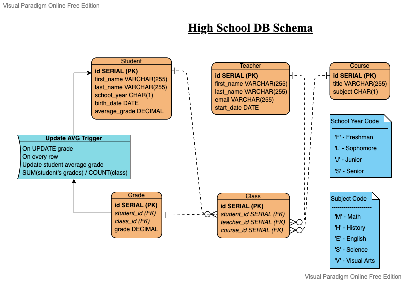

# School Database

## Description

A database for keeping track of classes and which students are taking them, which teachers are teaching them, and what course is being taught.
Also has data for students grades on a corresponding class. Queries and table creation ran successfully in SQL Fiddle with PostgreSQL.
Practicing my SQL skillz.

## Tables

Note: Nearly all values are required and constraints are set to NOT NULL

Student | Teacher
------- | --------
id SERIAL (PK) | id SERiAL (PK)
first_name Varchar(255) | first_name Varchar(255)
last_name Varchar(255) | last_name Varchar(255)
school_year CHAR(1) | email Varchar(255)
birth_date DATE | start_date DATE
average_grade DECIMAL | ~~

Course | Class | Grade
------ | ----- | ------
id SERIAL (PK) | id SERIAL (PK) | id SERIAL (PK)
title Varchar(255) | student_id (FK) | student_id (FK)
subject CHAR(1) | course_id (FK) | course_id (FK)
~~ | teacher_id (FK) | grade DECIMAL

## Notes on Character Codes

School Year Code | Subject Code
----------------- | ---------------
 F - Freshman | M - Math
 L - Sophomore | H - History
 J - Junior | E - English
 S - Senior | S - Science
 ~~ | V - Visual Arts 
  

## Improvements

* Slight optimization, make first_name and last_name columns not have Varchar set to 255, unlikely name would fill all of that space
* connect to a frontend and backend site
  * Backend handles communicating with database, frontend would be a dashboard to add and remove items from various tables
* Add trigger to update average_grade in student table by calculating when grade table updated

## Constributors

* Edgar Jr San Martin
